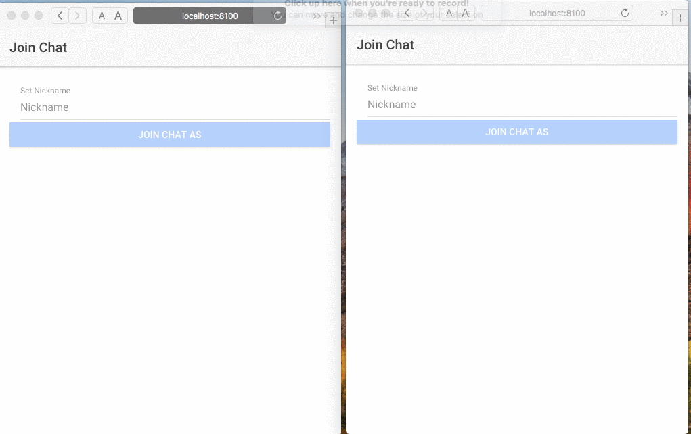

# Ionic Cross-Platform: Chatterbox 
The following would consist of the 
Ionic Example Project ( Chatterbox ~ A Real-time Chat Application ) for [Great Health Works](https://www.greathealthworks.com/)


## Getting Started

These instructions will instruct how to get the project setup, installed and running on your local machine for development and testing purposes. Enjoy!

### Project dependencies

The following would consist of project dependencies to properly run the application.
```
   - Angular 4 >= 8
   - Typescript 3.5
   - Ionic Cross-Platform Framework
   - Node.js( npm / yarn (i.e., Node Package Manager))
   - Express.js
   - MongoDB (mongoosejs)
   - Socketio
```
```
Used to build a real-time cross-platform chat application
```

### Installing dependencies

To Properly install run:
```
   - Install MongoDB & create collection
   - Download project
      ~ 1.) cd into project 
      ~ 2.) npm install
      ~ 3.) cd server
      ~ 4.) npm install
   - "npm install <dependcies-name>", listed above
```
### Running The Application:
```
  Modifiy config file and specify DB collection name
  /server
     |-- /config
           |-- config.js
```
NOTE
```
  Nodejs must be installed & MongoDB, mongo must be running in order to store message data
```

OSX
```
  Open Terminal and cd into the project root "/chatterboxV2", administrator rights maybe required
  - run npm run chatterbox
```
Windows
```
  Open CMD and cd into the project root "/chatterboxV2", administrator rights maybe required
  - run npm run chatterbox
```
### Usage
    The following would involve application usage.
```
    - Enter user name
    - Type into chat input field and press enter or click send
```
### Demo
The following is a demo of the application running ... 



## Testing
The following would relate to testing, application operation(s) tests methods, and processes
Test case 1
```
 - Running application Dual server states (node.js, express via single port: 3000)
```
Test case 2
```
 - User name input operation, and navParm (user name, to next page)
```
Test case 3
```
 - User chat input field operation (retrieve  navaParam), and update page with rxjs observable with user data
```
Test case 4
```
 - Socket.io real-time communication setup
 - Browser 1 & Browser2 (incognito) : review communication
```
Test case 5
```
 - Nodejs (Express.js)
 - Server Routes - Endpoint setup and testing
```
Test case 6
```
 - Nodejs (Mongoose.js)
 - Server Routering (DB)- Endpoint setup and testing & Collection insertion, retrieval operation
```
Edge Case:
```
I found testing the application straight forward while, I did running into a set of cases which affected the applications behavior, which would consist of the following:
    - route: /api/a/recentMessages & /api/a/ALLMessages
      * Functionality: Retrive most recently added record to databse & Retrieve ALL records within database collection
        - Assynchronous DB connection would result in 'undefined' error due to closing DB connection, which resulted in a failure to create an REST API query yet, would work the second attempt.
          ~ SOLUTION:
            Removing DB Closing function or implementing MongoDB Aggregate function - Futher inspection and review required..
```

## Deployment

Platform Dependent: General
```
Zip project and deploy to server, issue npm run chatterbox command 
```
## Built With
* Front-End (ionic, Angular.js 2x, HTML)

* [Ionic 3](https://ionicframework.com/) - The web framework used

* BackEnd (Nodejs, Express.js, Socket io, MongoDB(Mongoose.js))

* [Node.js](https://nodejs.org/api/) - BackEnd & Server Management
* [Express.js 4x](https://expressjs.com/en/4x/api.html) - BackEnd Server & Route Management
* [Socket.io](https://socket.io/docs/) - BackEnd Real-time Communication
* [MongoDB ~ Mongoosejs](https://docs.mongodb.com/manual/) - Used Create DB, Collection, Store Msg Data

## Authors

**Ramon J. Yniguez** - *Initial work* - [GitHub](https://github.com/theoneupkid88) - [Linkedin](https://www.linkedin.com/in/dryniguez) - [Freelance CRM](https://thefreelancecrm.com)


Please feel free to contact me if you have any questions or issues.


## Acknowledgments

* Hat tip to Great Health Works for giving me such an amazing opportunity & my fiancé for her patience
* Inspiration ~ Enjoy Software Developing
